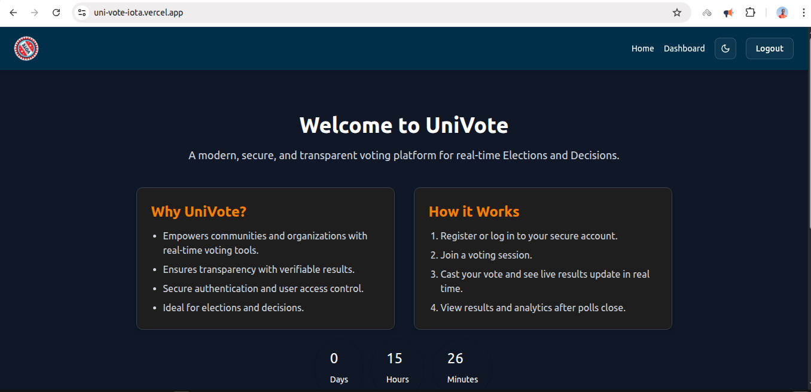
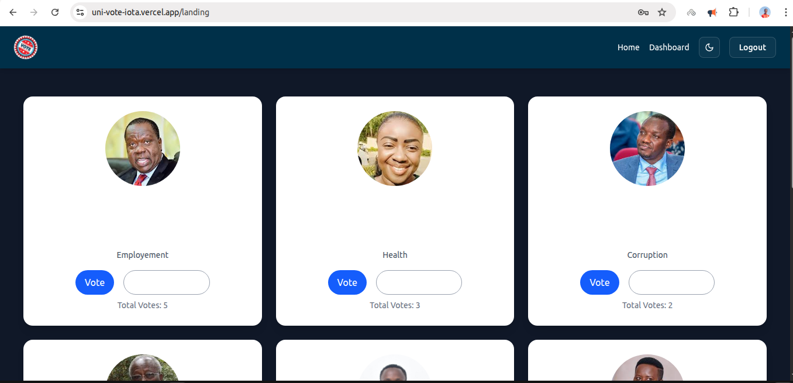
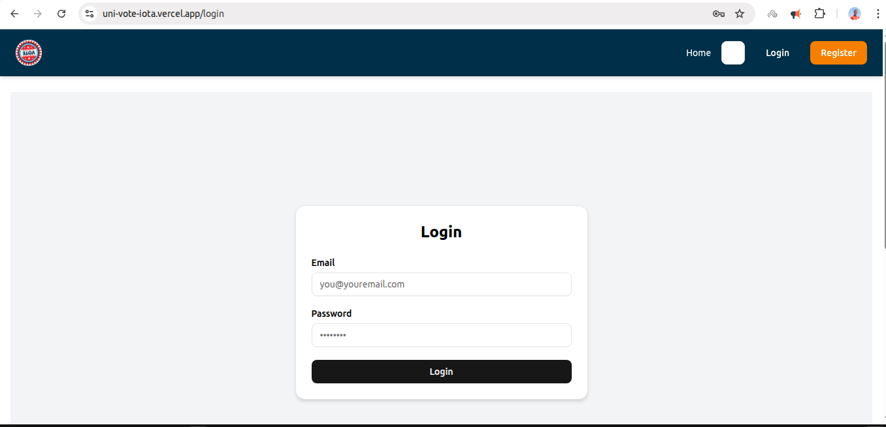
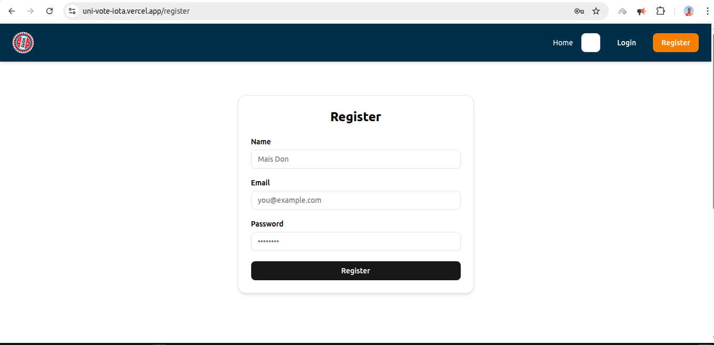

# 🗳️ UniVote

UniVote is a full-stack web application that enables users to vote for their preferred member representatives, view candidates, and manage voting services. Built using the MERN stack (MongoDB, Express, React, Node.js), it supports both user and admin functionalities including candidate creation, voting, and dashboard analytics.

---

## 📚 Table of Contents

- [Features](#features)
- [Tech Stack](#tech-stack)
- [Folder Structure](#folder-structure)
- [Getting Started](#getting-started)
- [Environment Variables](#environment-variables)
- [API Endpoints](#api-endpoints)
- [Deployment](#deployment)
- [Screenshots](#screenshots)
- [License](#license)

---

## ✅ Features

### 👤 Users
- Register and login
- View list of representatives by Different area
- Vote for a representative (only once)
- View candidate details in a modal

### 🔐 Admin
- Secure login and dashboard access
- Create and manage representatives
- Upload representative images
- Access vote analytics and active polls

---

## 🛠 Tech Stack

- **Frontend**: React, Tailwind CSS, React Router, Axios
- **Backend**: Node.js, Express, Mongoose, Multer
- **Database**: MongoDB (Atlas or Local)
- **Hosting**: Vercel (Frontend), Render (Backend)

## Screenshots
Home Page
    

Landing Page
    

Login
    

Register
    
# 📁 Folder Structure
```UniVote/
        ├── client/ # React frontend
        │ ├── public/
        │ ├── src/
        │ │ ├── assets/ # Images for reps
        │ │ ├── components/ # Shared components
        │ │ ├── pages/ # Page components
        │ │ └── App.jsx
        │ └── vite.config.js
        ├── server/ # Node.js backend
        │ ├── controllers/
        │ ├── models/
        │ ├── middleware/
        │ ├── routes/
        │ ├── utils/
        │ └── server.js
        └── README.md
```
# Getting Started

# 1. Clone the repository

```bash
git clone https://github.com/yourusername/UniVote.git
cd UniVote
2. Install Dependencies
# For backend
    cd server
    pnpm install

# For frontend
    cd ../client
    pnpm install
3. Setup Environment Variables
    Create .env in the /server folder:
        MONGO_URI=your_mongodb_connection_string
        JWT_SECRET=your_jwt_secret
4. Run the Application
# Start backend
    cd server
    pnpm run dev

# Start frontend
    cd ../client
    pnpm run dev
    Visit: http://localhost:5173

🔐 Authentication
    JSON Web Token (JWT) used for securing endpoints.

Admins have elevated privileges using a role: 'admin' field in the user model.

🌐 API Endpoints
Auth
    POST /api/auth/register

    POST /api/auth/login

Representatives
    GET /api/representatives - All representatives

    GET /api/representatives/my-member - Based on user ward

    POST /api/representatives - Admin only (image upload)

Voting
    POST /api/vote/:repId - Authenticated user vote

🖼️ Screenshots
    Replace with real screenshots of your app

 # Deployment
    Frontend (Vercel)
    Push client to GitHub

    Connect Vercel to the repo

    Set environment variable:

    VITE_API_URL=https://your-backend-url.com
    Backend (Render/Railway)
    Deploy the backend repo
